# Class文件结构

# 语言无关性

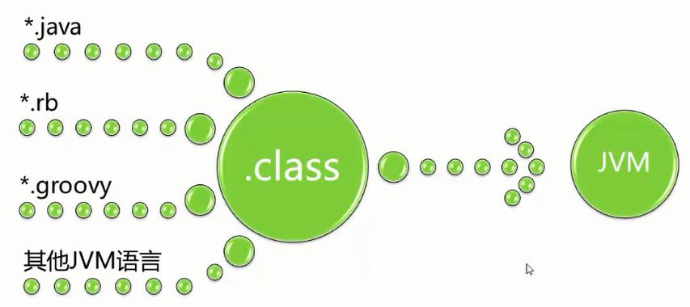

# 文件结构

Class文件是一组以8位字节为基础单位的二进制流，各个数据项目严格按照顺序紧凑排列在Class文件中，中间没有添加任何分隔符，整个Class文件中存储的内容几乎全部是程序运行的必要数据，没有空隙存在。当遇到需要占用8位字节以上空间的数据项，会按照高位在前的方式分割成若干个8位字节进行存储。Class由于没有任何分割符号，所以**下表中的数据项无论是顺序还是数量，数据存储的字节序都是被严格限定的。**

JVM规范规定，Class文件格式采用一种类似C语言结构体的伪结构来存储数据，这种伪结构只有两种数据类型：无符号数和表。无符号数可以用来描述数字、索引引用、按照UTF-8编码构成字符串值。表是由多个无符号数或者其他表作为数据项构成的符合数据类型，所有表都习惯性以"_info"结尾。表用于描述有层次关系的复合结构的数据，整个Class文件本质上就是一张表。

无论是无符号数还是表，当需要描述同一类型但数量不定的多个数据时，经常会使用一个前置的容量计数器加若干个连续的数据项的形式，这时称这一系列连续的某一类型的数据为某一类型的集合。

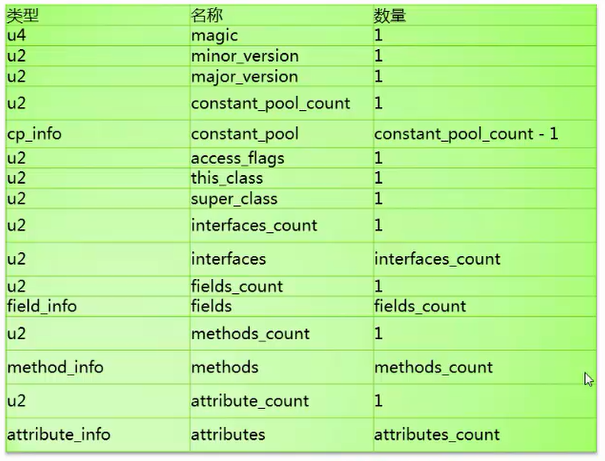

## 魔数与Class文件版本

每个Class文件的头4个字节称为魔数（Magic Number），它的唯一作用是确定这个文件是否为一个能被虚拟机接受的Class文件。值为：0xCAFEBABE

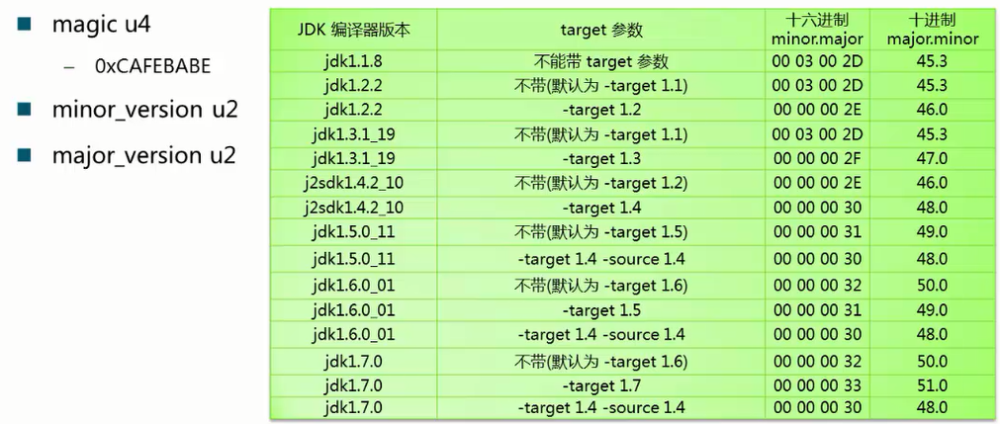

 ## 常量池

常量池可以理解为Class文件中资源仓库，是Class文件结构中与其他项目关联最多的数据类型，也是占用Class文件空间最大的数据项目之一，还是Class文件中第一个出现的表类型数据项目。

由于常量池中常量的数量是不固定的，所以在常量池的入口需要放置一项u2类型的数据，代表常量池容量计数值（constant_pool_count）。**特殊的一点是，常量池中的实际使用的容量是constant_pool_count-1,因为第0项常量被空出来用来有其他含义。**对于其他集合类型则没有这个情况。

常量池中主要存放两大类常量：字面量和符号引用。字面量比较接近Java语言的常量概念，如文本字符串、声明为final的常量值等。符号引用则属于编译原理的概念，包括1)类和接口的全限定名 2)字段的名称和描述符  3）方法的名称和描述符

常量池中每一项常量都是一个表，表开始的第一位是一个标志位，代表这个常量属于那种常量类型。

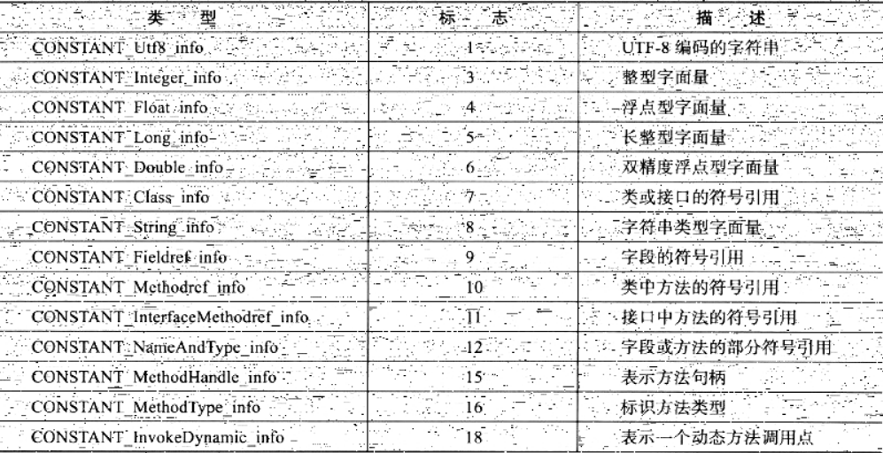

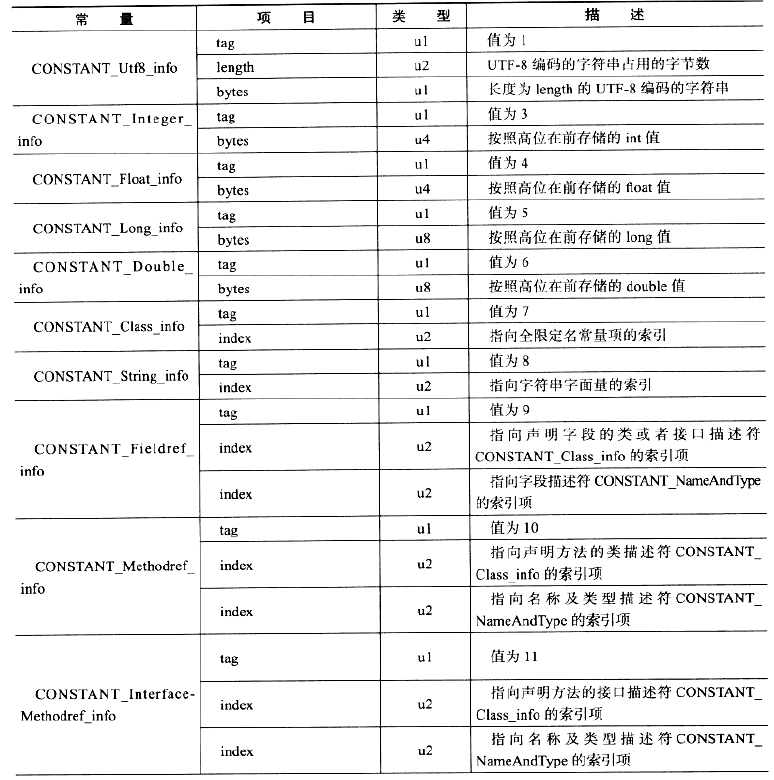

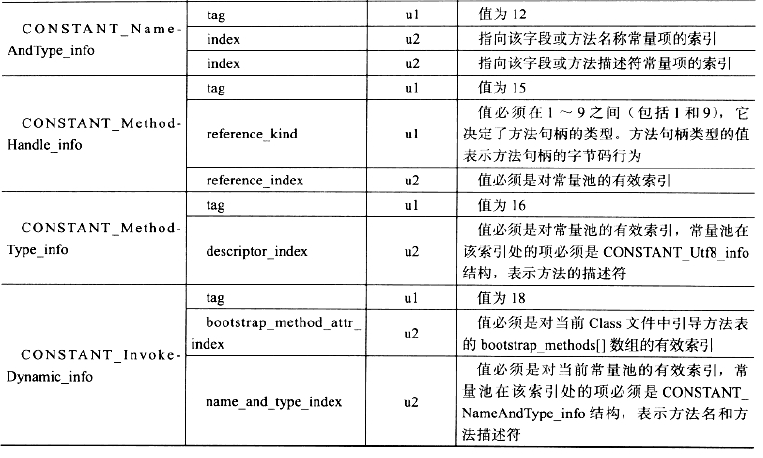

## 访问标志

这个标志用于识别一些类或者接口层次的访问信息，包括：这个Class是类还是接口；是否定义为public类型；是否定义为abstract类型；如果是类的话，是否被声明为final等。

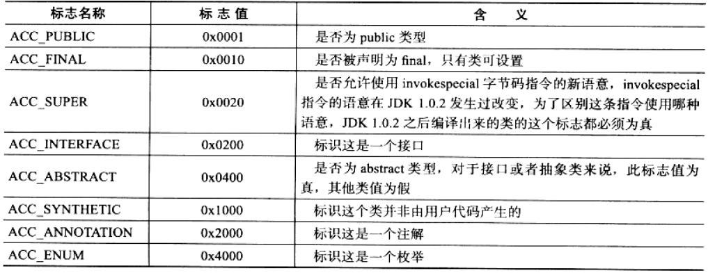

## 类索引、父类索引与接口索引集合

类索（this_class）和父类索引（super_class）都是一个u2类型的数据；而接口索引集合（interfaces）是一组u2类型的数据的集合，Class文件中由这三项数据来确定这个类的继承关系。

类索引用于确定这个类的全限定名，父类索引用于确定这个类的父类的全限定名。Java中父类索引只有一个，除了java.lang.Object之外，所有的Java类都有父类。Java接口顺序从左到右排列在接口索引集合中。

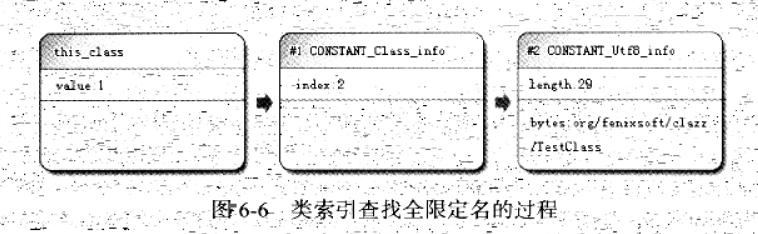

## 字段表集合

字段表用于描述接口或者类中声明的变量。

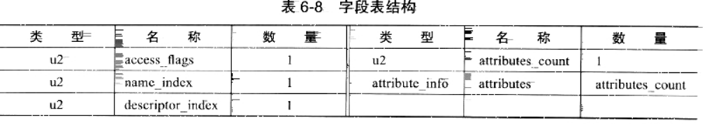

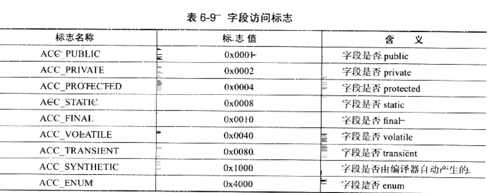

描述符规则，基本数据类型(byte,char,double,float,int,long,short,boolean)以及代表无返回数的void类型都用一个大写字符来表示，对象类型则用字符L加对象的全限定名来表示。

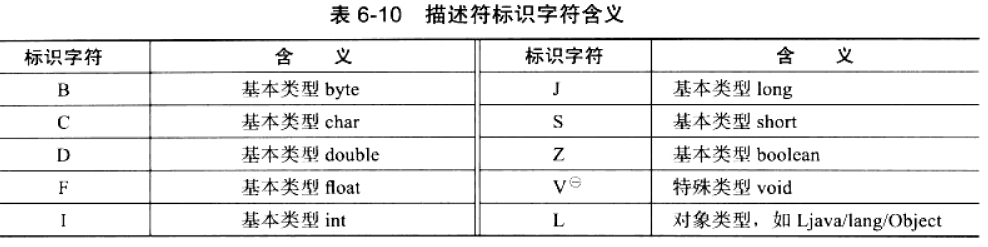

对于数组类型，每一维度将使用一个"["来描述，String  [] []类型的二维数组被记录为"[[Ljava/lang/String",一个整型数组"int[]"记为"[I"。

用描述符来描述方法时，按照先参数列表，后返回值的顺序描述，参数列表按照参数的严格顺序放在一组小括号"()"之内。方法void inc()的描述符为"()V"。

## 方法表集合

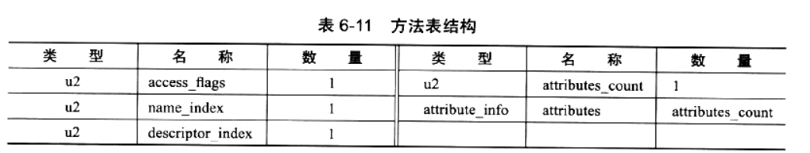

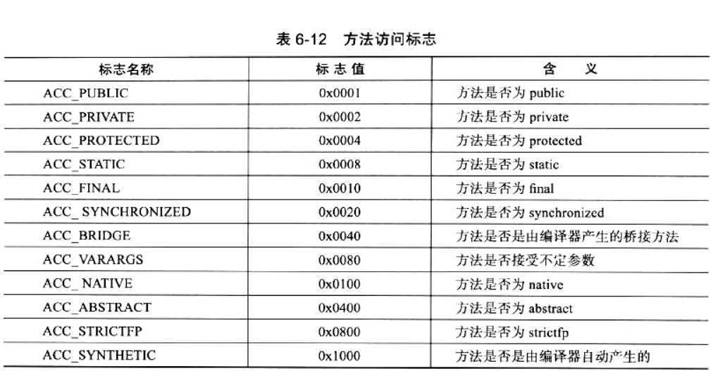

方法的定义可以通过访问标志、名称索引、描述符索引表达清楚。方法里的Java代码经过编译器编译成字节码指令后，存放在方法属性表集合中一个名为“Code”的属性里面。

如果父类方法在子类中没有被重写，方法表集合中就不会出现来自父类的方法信息。但是有可能出现有编译器自动添加的方法，例如类构造器< clint >和实例构造器< init>方法。

Java重载方法除了要具有相同的名称之外还必须有一个与原方法不同的特征签名，特征签名就是一个方法中各个参数在常量池中的字段符号引用集合，由于返回值不会包含在特征签名中，因此Java语言无法仅仅通过返回值的不同来对一个已有方法进行重载。

## 属性表集合

在Class文件、字段表、方法表都可以携带自己的属性表集合，用于描述某些场景专有的信息。

属性表集合的限制稍微宽松，不再要求各个属性表具有严格顺序，只要不与已有属性名重复，任何人实现的编译器都可以向属性表中写入自己定义的属性信息。

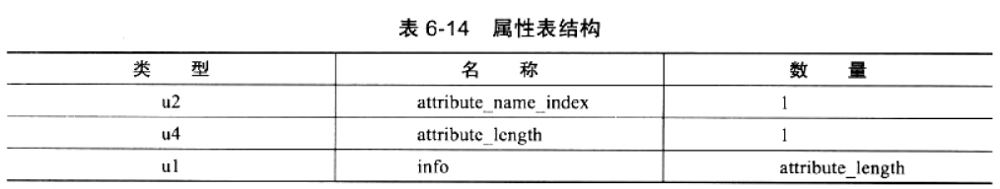

1. code属性
2. Exceptions属性
3. LineNumberTable属性
4. LocalVariableTable属性
5. SourceFile属性
6. ConstantValue属性
7. InnerClasses属性
8. Deprecated 及Synthetic 属性
9. StackMapTable属性
10. Signature属性
11. BootstrapMethods属性

# 字节码指令

JVM的指令由**一个字节**长度、代表某种特定操作含义的数字（称为操作码）以及跟随其后的零至多个代表此操作数所需参数（称为操作数）而构成。由于JVM面向操作数栈而不是寄存器的架构，所以大多数的指令都不包含操作数，只有一个操作码。

由于限制了JVM操作码长度为一个字节，意味着指令集的操作码总数不可能超过256条。

在不考虑异常处理的情况下，JVM解释器执行模型为：

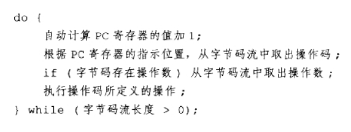

## 字节码与数据类型

JVM指令集中大多数指令都包含器操作对应的数据类型信息，iload用于从局部变量表中加载int数据到操作数栈中，fload指令加载的是float数据。由于指令集数有限，有一些单独的指令可以在必要的时候用来将一些不支持的类型转换为可被支持的类型。

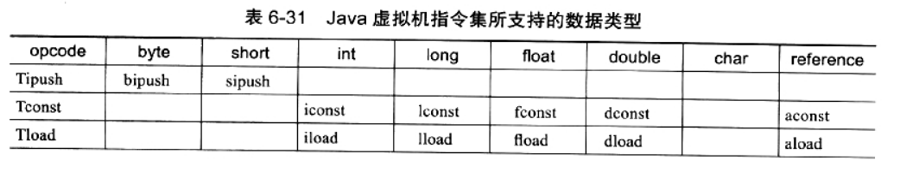

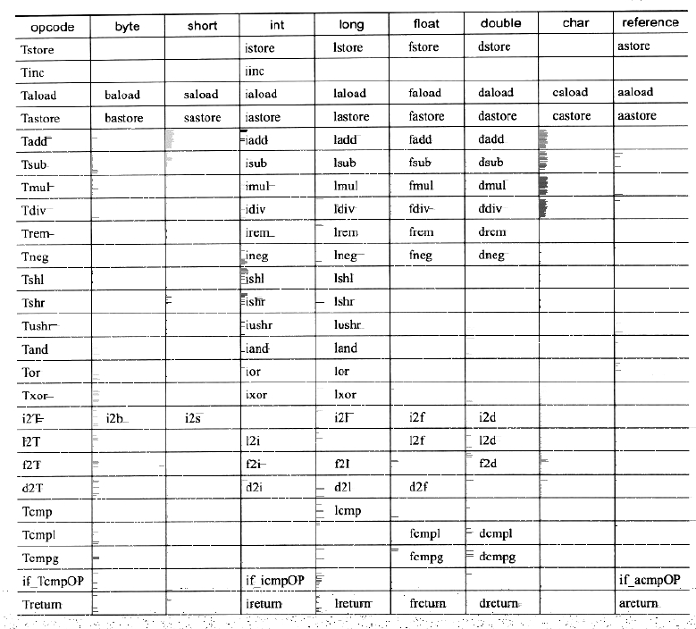

## 加载和存储指令

加载和存储指令用于将数据在帧栈中的局部变量表和操作数栈之间来回传输。

存储数据的操作数栈和局部变量表主要就是由加载和存储指令进行操作，除此之外还有少量指令，如访问对象的字段或数组元素的指令也会向操作数栈传输数据。

## 运算指令

运算或算术指令用于对两个操作数栈上的值进行某种特定运算，并把结果重新存入到操作栈顶。

## 类型转换指令

类型转换指令可以将两种不同的数值类型进行相互转换，这些转换操作一般用于实现用户代码中的显式类型转换操作，或者用来处理字节码指令集中数据类型相关指令无法与数据类型一一对应的问题。

## 对象创建与访问指令

虽然类实例和数组都是对象，JVM对类实例和数组的创建与操作使用不同的字节码指令。对象创建后，就可以通过对象访问指令获取对象实例或者数组实例中的字段或数组元素。

## 操作数栈管理指令

JVM提供一些用于直接操作操作数栈的指令。

## 控制转移指令

控制转移指令可以让JVM有条件或无条件地从指定地位置指令而不是控制转移指令的下一条指令继续执行程序。从概念模型上理解，可以认为控制转移指令就是有条件或无条件地修改PC寄存器的值。

## 方法调用和返回指令

方法调用指令与数据类型无关，方法返回指令是根据返回值的类型区分的。

## 异常处理指令

在Java程序中显式抛出异常的操作（throw语句）都由athrow指令来实现，除了用throw语句显式抛出异常情况之外，Java虚拟机规范还规定了许多运行时异常会在其他Java虚拟机指令检测到异常状况时自动抛出。

而在Java虚拟机中，处理异常（catch语句）不是由字节码指令来实现的，而是采用异常表来完成的。

## 同步指令

Java虚拟机可以支持方法级的同步和方法内部一段指令序列的同步，这两种同步结构都是使用管程（Monitor）来支持的。