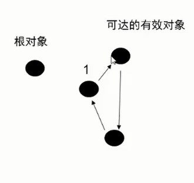
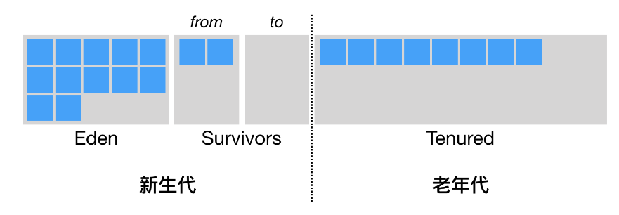
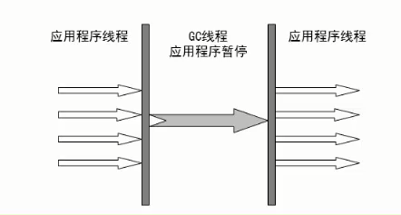
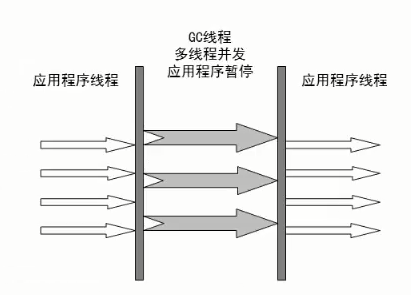
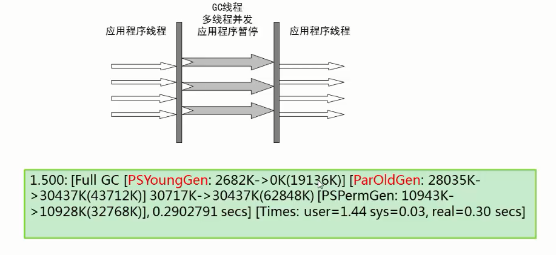
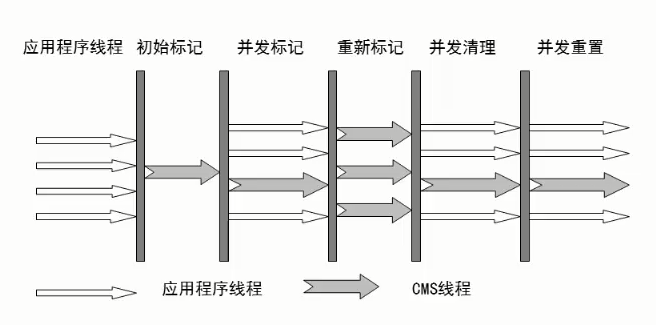
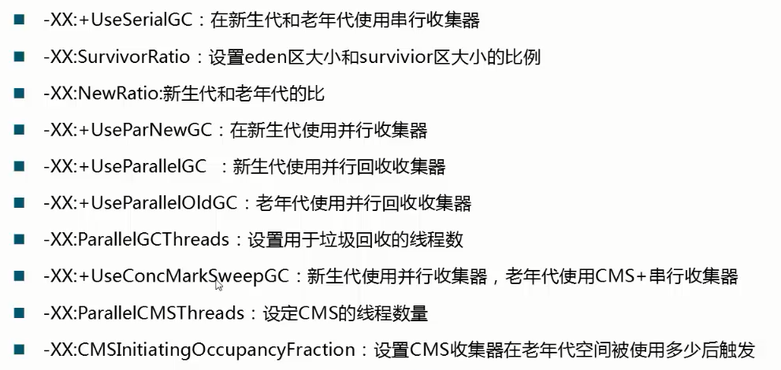
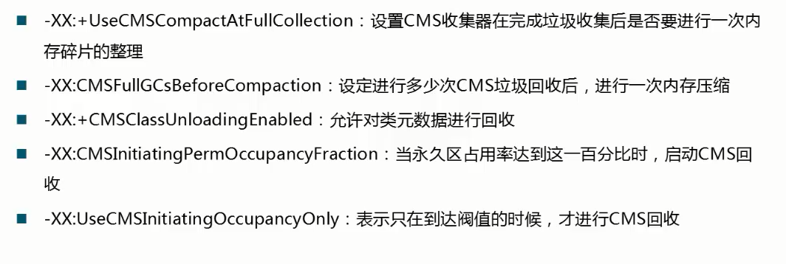

# GC

# 1.GC的概念

Java中，GC的对象时堆空间和永久区。

## 应用计数法

老牌垃圾回收算法，通过引用计数来回收垃圾。对于一个对象A，只要有任何一个对象引用了A，则A的引用计数器就加1，当引用失效时，引用计数器就减1。只要对象A的引用计数器的值为0，则对象A就不可能再被使用。

引用计数法的问题：

- 引用和去引用伴随加法和减法，影响性能。
- 很难处理循环引用。

如图，成环的三个都不可回收。没有被JVM采用

## 标记-清除

标记-清除算法是现代垃圾回收算法的思想基础。标记-清除算法将垃圾回收分为两个阶段：**标记阶段**和**清除阶段**。一种可行的实现是，在标记阶段，首先通过根节点，标记所有从根节点开始的可达对象。因此，未被标记的对象就是未被引用的垃圾对象。然后，在清除阶段，清除所有未被标记的对象。

## 标记-压缩

标记-压缩算法适合用于存活对象较多的场合，如老年代。它在标记-清除算法的基础上做了一些优化。和标记-清除算法一样，标记-压缩算法也首先需要从根节点开始，堆所有可达对象做一次标记。之后，并不简单的清理未标记对象，而是将所有的存活对象压缩到内存的一端。之后，清理边界外所有的空间。

## 复制算法

与标记-清除算法相比，复制算法是一种相对高效的回收方法。

不适用于存活对象较多的场合如老年代。

将原有的内存空间分为两块，每次只使用其中一块，在垃圾回收时，将正在使用的内存中的存活对象复制到未使用的内存块中，之后，清除正在使用的内存块中的所有对象，交换两个内存的角色，完成垃圾回收。

复制算法的最大问题是：空间浪费

## 分代思想

依据对象的存活周期进行分类，短命对象归为新生代，长命对象归为老年代。

根据不同代的特点，选取合适的收集算法

- 少量对象存活，适合复制算法
- 大量对象存活，适合标记清理或者标记压缩

# 2.可触及性

可触及的

- 从根节点可以触及到这个对象

可复活的

- 一旦所有引用被释放，就是可复活状态
- 因为在finalize()中可能复活该对象

不可触及的

- 在finalize()后，可能会进入不可触及状态
- 不可触及的对象不可能复活
- 可以回收

经验：避免使用finalize()，操作不慎可能导致错误，优先级低，何时被调用不确定，何时发生GC不确定。

根：

- 栈中引用的对象
- 方法区中静态成员或者常量引用的对象（全局对象)
- JNI方法栈中引用对象

# 3.Stop-The-World

- Java中一种全局暂停的现象
- 全局停顿，所有Java代码停止，native代码可以执行，但不能和JVM交互
- 多半由于GC引起 

解决方法：

- Dump线程
- 死锁检查
- 堆Dump

GC全局停顿的原因：类比在聚会时打扫房间，聚会时很乱，又有新的垃圾产生，房间永远打扫不干净，只有让大家停止活动了，才能将房间打扫干净。

危害：长时间服务停止，没有响应。遇到HA系统，可能引起主备切换，严重危害生产环境。

在 Java 虚拟机里，传统的垃圾回收算法采用的是一种简单粗暴的方式，那便是 Stop-the-world，停止其他非垃圾回收线程的工作，直到完成垃圾回收。这也就造成了垃圾回收所谓的暂停时间（GC pause）。

Java 虚拟机中的 Stop-the-world 是通过安全点（safepoint）机制来实现的。当 Java 虚拟机收到 Stop-the-world 请求，它便会等待所有的线程都到达安全点，才允许请求 Stop-the-world 的线程进行独占的工作。

# 4. JVM GC具体实现

**Java 虚拟机的分代垃圾回收是基于大部分对象只存活一小段时间，小部分对象却存活一大段时间的假设的。**

Java 虚拟机将**堆**分为**新生代**和**老年代**，并且对不同代采用不同的垃圾回收算法。

 JVM的堆区对象分配的一般规则：

1. 对象优先在Eden区分配，也会有栈上对象的情况（小对象，只用在一个线程）。
2. 大对象直接进入老年代（-XX:PretenureSizeThreshold=3145728 这个参数来定义多大的对象直接进入老年代）

3. 长期存活的对象将进入老年代

4. 动态对象年龄判定（虚拟机并不会永远地要求对象的年龄都必须达到MaxTenuringThreshold才能晋升老年代，如果Survivor空间中相同年龄的所有对象的大小总和大于Survivor的一半，年龄大于或等于该年龄的对象就可以直接进入老年代）

5. 空间分配担保

6. 只要老年代的连续空间大于（新生代所有对象的总大小或者历次晋升的平均大小）就会进行**minor GC**，否则会进行**full GC==major GC**

## 新生代

新生代分为 Eden 区和两个大小一致的 Survivor 区，并且其中一个 Survivor 区是空的。

当 **Eden 区**的空间耗尽时Java 虚拟机便会触发一次 Minor GC，来收集新生代的垃圾。存活下来的对象，则会被送到 Survivor 区。分别用 from 和 to 来指代。其中 to 指向的 Survivior 区是空的。

在只针对新生代的 **Minor GC** 中，采用**复制算法**。Eden 区和非空 Survivor 区的存活对象会被**复制**到空的 Survivor 区中，当 Survivor 区中的存活对象复制次数**15**（对应虚拟机参数 -XX:+MaxTenuringThreshold）时，它将被晋升至老年代。如果单个 Survivor 区已经被占用了 50%（对应虚拟机参数 -XX:TargetSurvivorRatio），那么较高复制次数的对象也会被晋升至老年代。

理想情况下，Eden 区中的对象基本都死亡了，那么需要复制的数据将非常少，因此采用复制算法的效果极好。

Minor GC 的另外一个好处是不用对整个堆进行垃圾回收。Java 虚拟机引入了名为卡表的技术，大致地标出可能存在老年代到新生代引用的内存区域。

## 老年代

老年代的对象比较稳定，所以**MajorGC**不会频繁执行。在进行MajorGC前一般都先进行了一次MinorGC，使得有新生代的对象晋身入老年代，导致空间不够用时才触发。当无法找到足够大的连续空间分配给新创建的**较大对象**时也会提前触发一次MajorGC进行垃圾回收腾出空间。

MajorGC一般采用**标记-压缩**算法。MajorGC的耗时比较长。

当老年代也满了装不下的时候，就会抛出**OOM**（Out of Memory）异常。

## 永久代

指内存的永久保存区域，主要存放Class和Meta（元数据）的信息,Class在被加载的时候被放入永久区域. 它和和存放实例的区域不同,GC不会在主程序运行期对永久区域进行清理。所以这也导致了永久代的区域会随着加载的Class的增多而胀满，最终抛出OOM异常。

在Java8中，永久代已经被移除，被一个称为“元数据区”（元空间）的区域所取代。

元空间的本质和永久代类似，都是对JVM规范中方法区的实现。不过元空间与永久代之间最大的区别在于：**元空间并不在虚拟机中，而是使用本地内存。**因此，默认情况下，元空间的大小仅受本地内存限制。类的元数据放入 native memory, 字符串池和类的静态变量放入java堆中. 这样可以加载多少类的元数据就不再由MaxPermSize控制, 而由系统的实际可用空间来控制.

# 5.垃圾回收器

## 串行回收器

- 最古老，最稳定
- 效率高
- 可能会产生较长的停顿

-XX:+UseSerialGC 

- 新生代、老年代使用串行回收
- 新生代复制算法
- 老年代标记-压缩

## 并行回收器ParNew

- Serial收集器新生代的并行版本

- 复制算法

- 多线程，需要多核支持

- -XX:ParallelGCThreads 限制线程数量

  

-XX:+UseParNewGC

- 新生代**并行**
- 老年代**串行**

## 并行收集器 Parallel

- 类似ParNew
- 新生代复制算法
- 老年代 标记-压缩
- 更加关注吞吐量

-XX:+UseParallelGC

- 使用Parallel收集器+老年代串行

-XX:+UseParallelOldGC

- 使用Parallel收集器+并行老年代

-XX:MaxGCPauseMills

- 最大停顿时间，单位毫秒
- GC尽力保证回收时间不超过设定值

-XX:GCTimeRatio

- 0-100的取值范围
- 垃圾收集时间占总时间的比
- 默认99，即最大允许1%时间做GC

这两个参数是矛盾的，因为停顿时间和吞吐量不可能同时调优。

## CMS收集器

- Concurrent Mark Sweep**并发**标记清除,与用户线程一起执行。
- 标记-清除算法
- 与标记-压缩相比并发阶段会降低吞吐量
- 老年代收集器（新生代使用ParNew）
- -XX:+UseConcMarkSweepGC

CMS运行过程比较复杂，着重实现了标记的过程，可分为：

- 初始标记 

- - 跟可以直接关联到的对象
  - 速度快

- 并发标记(和用户线程一起)

- - 主要标记过程，标记全部对象

- 重新标记

- - 由于并发标记时，用户线程依然运行，因此在正式清理前，再做修正

- 并发清除（和用户线程一起）

- - 基于标记结果，直接清理对象

  

  

特点：

- 尽可能降低停顿，所以采用了标记-清除

- 会影响系统整体吞吐量和性能

- - 比如，在用户线程运行过程中，分一半CPU去做GC，系统性能在GC阶段，反应速度就下降一半

- 清理不彻底
- - 因为在清理阶段，用户线程还在运行，会产生新的垃圾，无法清理
- 因为和用户线程一起运行，不能在空间快满时再清理
- - -XX:CMSInitiatingOccupancyFraction设置触发GC的阈值
- - 如果不幸内存预留空间不够，就会引起concurrent mode failure

-XX+UseCMSCompactAtFullCollection Full GC后，进行一次整理

- 整理过程是独占的，会引起停顿时间变长

-XX：+CMSFullGCsBeforeCompaction

- 设置进行几次FullGC后，进行一次碎片整理
  
  
  

-XX:ParallelCMSThreads

- 设定CMS的线程数量

## GC参数整理

性能的根本在于应用，GC参数属于微调，设置不合理会影响性能，产生大的时延。