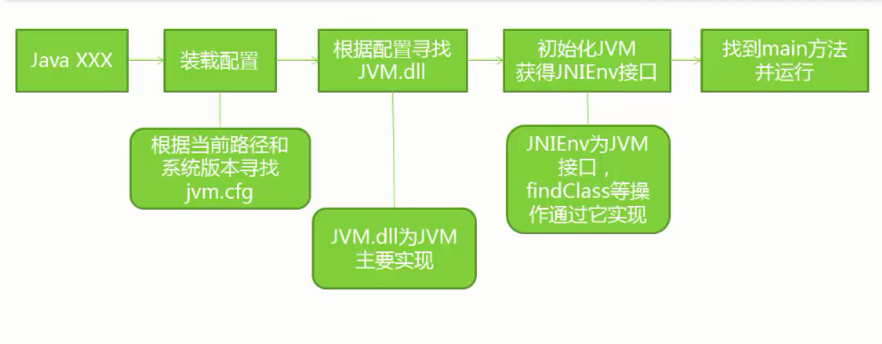
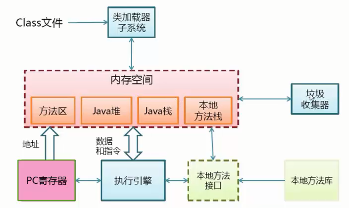
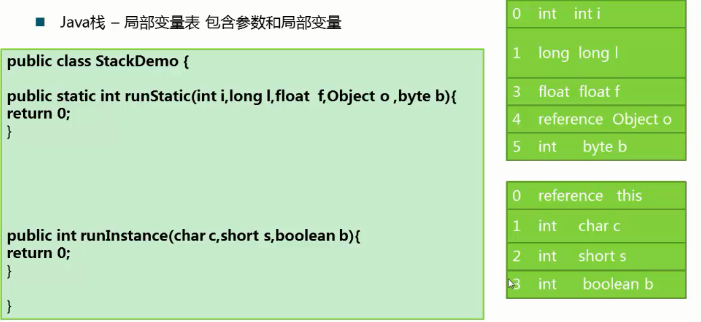
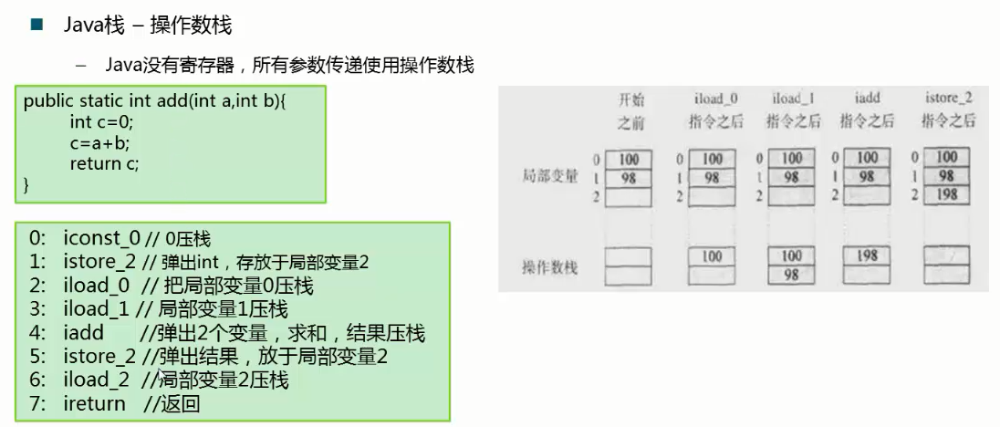
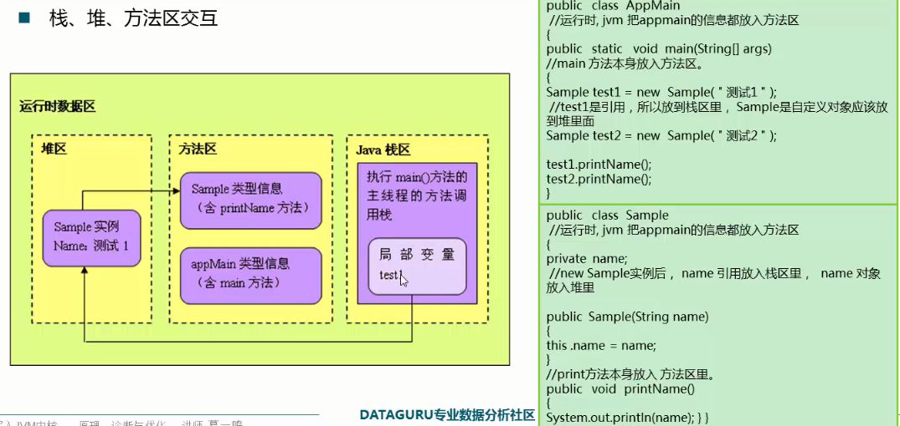
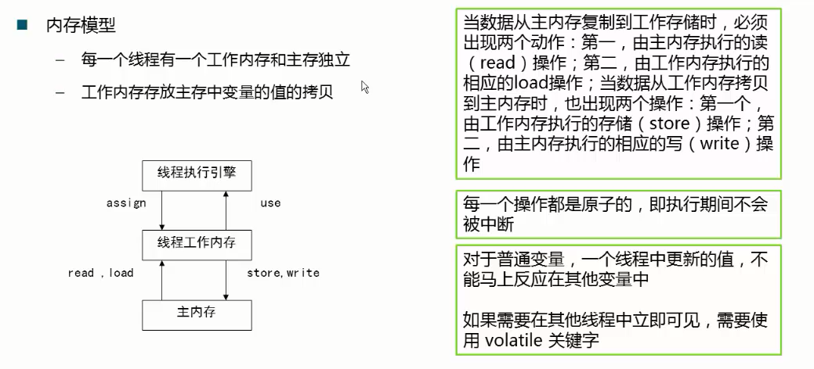
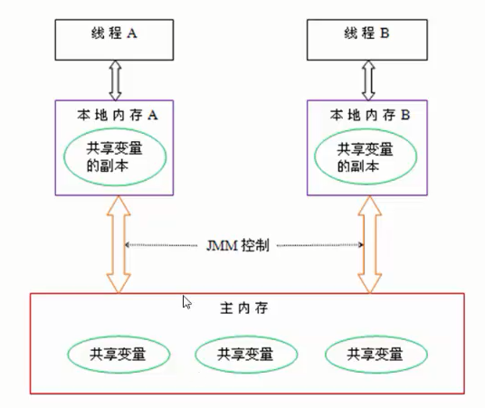
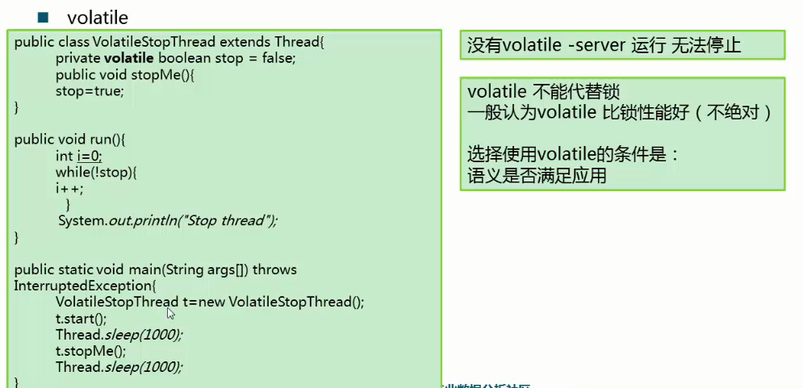

# JVM运行机制

# 1.JVM启动流程

# 2.JVM基本结构

## PC寄存器

- 每个线程拥有一个PC寄存器，在线程创建时创建指向下一条指令的地址。
- 执行本地方法时，PC的值为undefind。

## **方法区**

- 保存装载的类信息，包括类型的常量池，字段、方法信息，方法字节码。
- 通常和永久区关联在一起。
- JDK6时，String等常量信息置于方法区，JDK7时，已经移动到了堆。

## **Java堆**

- 和程序开发密切相关。
- 应用系统对象都保存在Java堆中。
- 所有线程共享Java堆。
- 对分代GC来说，堆也是分代的。
- GC的主要工作区间。

## **Java栈**

- 线程私有
- 栈由一系列帧组成（因此Java栈也叫做帧栈）
- 帧保存一个方法的局部变量、操作数栈、常量池指针
- 每一个方法调用创建一个帧，并压栈

第二个实例方法中第一个为引用，即引用当前对象。

Java栈-栈上分配

- 小对象(一般几十个bytes),在没有逃逸(即仅在一个线程中使用)的情况下，可以直接分配在栈上。
- 直接分配在栈上，可以自动回收，减轻GC压力。
- 大对象或者逃逸对象无法栈上分配。

# 3.内存模型

# 4.编译和解释运行的概念

JVM的两种执行方式。

