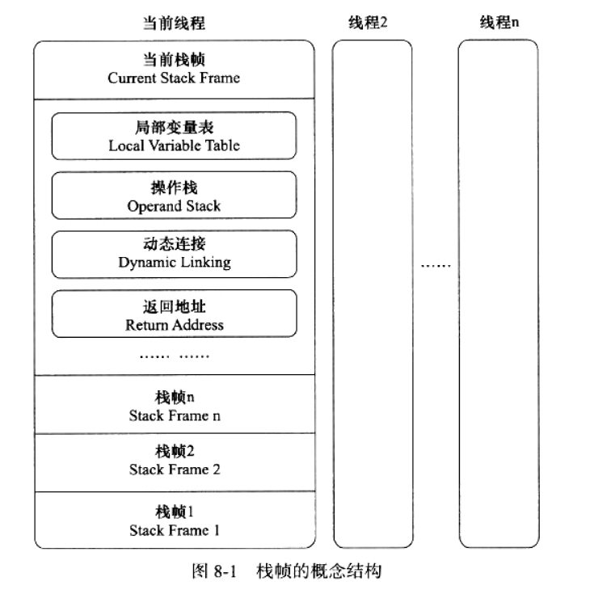
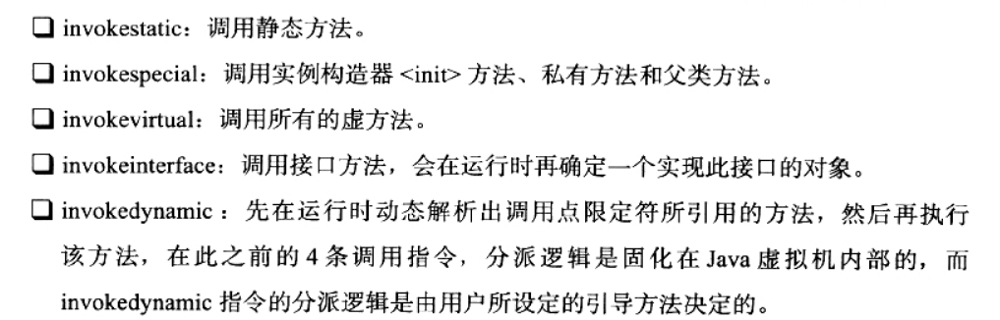
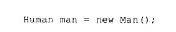

# 字节码执行

执行引擎是JVM最核心的组成部分之一。

> javap -verbose 类名 //反汇编

# 运行时栈帧结构

栈帧（Stack Frame）是用于支持JVM方法调用和方法执行的数据结构，是JVM运行时数据区中的虚拟机栈的栈元素。栈帧存储了方法的**局部变量表、操作数栈、动态连接和方法返回地址**等信息。每一个方法从调用开始至执行完成的过程，都对应着一个帧栈在虚拟机栈里面从入栈到出栈的过程。

对于执行引擎，在活动线程中，只有位于栈顶的帧栈才是有效的，称为**当前帧栈**。执行引擎运行所有字节码指令都只针对当前帧栈进行操作。

## 局部变量表

局部变量表（Local Variable Table）是一组变量值存储空间，用于存放**方法参数**和方**法内部定义的局部变量**。在Java程序编译为Class文件时，就在方法的Code属性的max locals数据项中确定了该方法所需要分配的局部变量表的最大容量。

局部变量表的容量以变量槽（Variable Slot，下称Slot）为最小单位，虚拟机规范中并没有明确指明一个Slot应占用的内存空间大小，只是很有导向性地说到每个Slot都应该能存放一个boolean、byte、char、short、int、float、reference或returnAddress类型的数据，这8种数据类型，都可以使用32位或更小的物理内存来存放。

一个Slot可以存放一个32位以内的数据类型，对于64位的数据类型，虚拟机会以高位对齐的方式为其分配两个连续的Slot空间。64位数据类型只有long和double两种，由于局部变量表建立在线程的堆栈上，是线程私有的数据，无论读写两个Slot是否为原子操作，都不会引起数据安全问题。

JVM通过**索引定位**的方式使用局部变量表，索引范围是0到最大Slot数量。

## 操作数栈

操作数栈（Operand Stack）也常称为操作栈，它是一个后入先出（Last In First Out，LIFO）栈。同局部变量表一样，操作数栈的最大深度也在编译的时候写入到Code属性的max_stacks数据项中。操作数栈的每一个元素可以是任意的Java数据类型，包括long和double。32位数据类型所占的栈容量为1，64位数据类型所占的栈容量为2。在方法执行的任何时候，操作数栈的深度都不会超过在max_stacks数据项中设定的最大值。

## 动态连接

每个栈帧都包含一个指向运行时常量池中该帧栈所属方法的引用，持有这个应用是为了支持方法调用过程中的动态连接(Dynamic Linking)。

## 方法返回地址

当一个方法开始执行后，只有两种方式可以退出，第一种是遇到方法返回字节码指令，称为**正常完成出口**。第二种是JVM内部异常或者字节码指令产生异常，导致的**异常完成出口**，是不会给它的上层调用者产生任何返回值的。

无论采取何种退出方式，在方法退出后都需要返回到方法被调用的位置，程序才能继续执行，方法返回时可能需要在帧栈种保存一些信息，用来帮助恢复上层方法的执行状态。

方法退出的过程实际上就等同于把当前栈帧出栈，因此退出时可能执行的操作有：恢复上层方法的局部变量表和操作数栈，把返回值（如果有的话）压入调用者栈帧的操作数栈中，调整PC计数器的值以指向方法调用指令后面的一条指令等。

## 附加信息

虚拟机规范允许其体的虚拟机实现增加一些规范里没有描述的信息到栈帧之中，例如与调试相关的信息，这部分信息完全取决于具体的虚拟机实现，这里不再详述。在实际开发中，一般会把动态连接、方法返回地址与其他附加信息全部归为一类，称为栈帧信息。

# 方法调用

方法调用不等同于方法执行，**方法调用阶段唯一的任务就是确定被调用方法的版本（即调用哪一个方法）**，暂时还不涉及方法内部的具体运行过程。**在程序运行时，进行方法调用时最普遍最频繁的操作。**由于Class文件的编译过程中不包含传统编译中的连接步骤，一切方法调用在Class文件里面存储的都只是符号引用，而不是方法在实际运行时内存布局中的入口地址。给Java带来更强大的动态扩展能力，需要在类加载期间甚至运行期间才能确定目标方法的直接引用。

## 解析

解析调用一定是个静态过程，在编译期间就完全确定，在类装载的解析阶段就会把涉及的符号引用全部转变为可确定的直接引用，不会延迟到运行期再去完成。

符合“编译期可知，运行期不可变”的方法适合在**类加载阶段进行解析**，包括静态方法和私有方法两大类。因为其方法在程序真正运行之前就有一个可确定的调用版本，并且这个方法的调用版本在运行期是不可改变的。

JVM提供5条方法调用字节码指令：

只要能被invokestatic和invokespecial指令调用的方法，都可以在解析阶段中确定唯一的调用版本，符合这个条件的有**静态方法、私有方法、实例构造器、父类方法4类**，它们在类加载的时候就会把符号引用解析为该方法的直接引用。这些方法可以称为非虚方法，与之相反，其他方法称为虚方法（除去final方法，final在规范中属于非虚方法）。

## 分派

分派调用过程将会揭示**多态性特征**的一些最基本的体现。解析和分派两者不是派他关系，是不同层次上去筛选、确定目标方法的过程。

### 静态分派

Human为变量的静态类型，或者外观类型，Man是实际类型。变量的静态类型不会改变，静态类型是在编译期可知的；实际类型在运行期才可确定。

所有依赖静态类型来定位方法执行版本的分派动作称为静态分派。静态分派的典型应用是**方法重载**。静态分派发生在**编译阶段**，因此确定静态分派动作实际上不是由虚拟机来执行的。

### 动态分派

动态分派是非常频繁的动作，所以采用的手段是为类在方法区中建立一个虚方法表，虚方法表中存放着各个方法的实际入口地址。如果某个方法在子类中没有被重写，子类的虚方法表里面的地址入口和父类相同方法的地址入口是一致的，都指向父类的实现入口。如果子类中重写了这个方法，子类方法表中的地址将会替换为指向子类实现版本的入口地址。为了程序实现上的方便，具有相同签名的方法，在父类、子类的虚方法表中都应当具有一样的索引序号。

方法表一般在类加载的连接阶段进行初始化，准备了类的变量初始值后，虚拟机会把该类的方法表也初始化完毕。

# 基于栈的字节码解释执行

