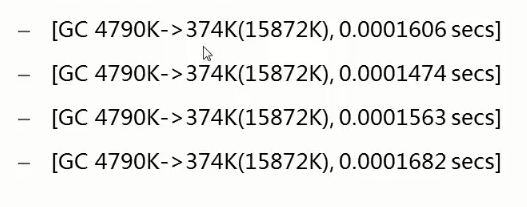
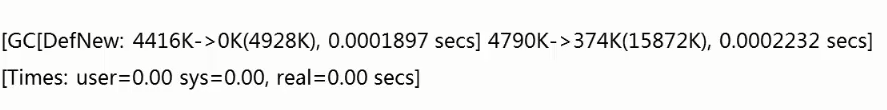
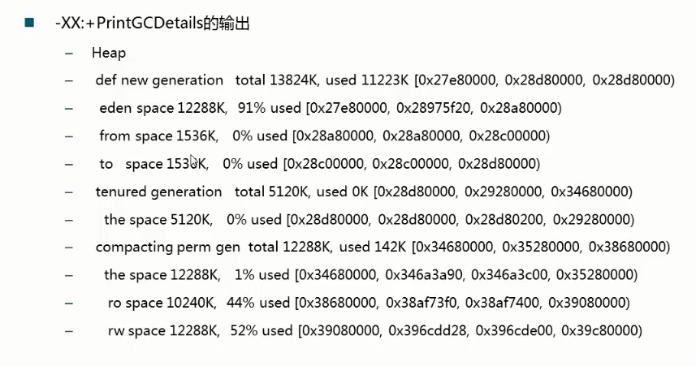
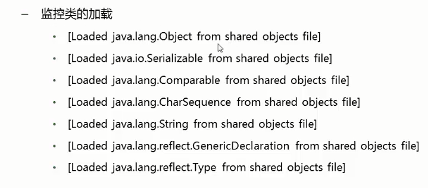
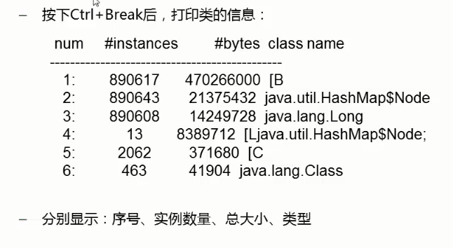
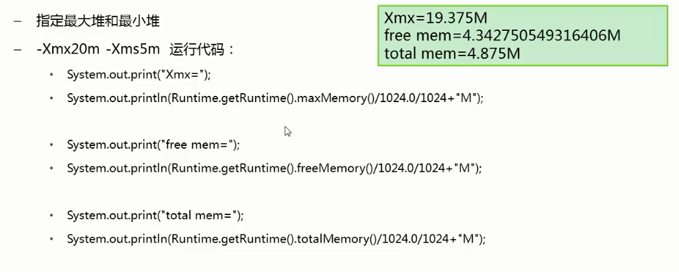
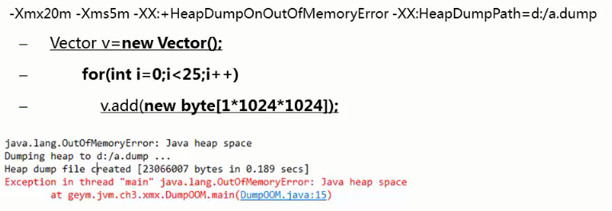
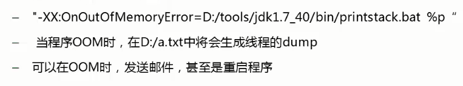

#  常用JVM配置参数

# 1.Trace跟踪参数

-verbose:gc

-XX:+printGC

可以打印GC的简要信息

> -XX:+PrintGCDetails //打印GC详细信息，在程序结束后打印

> -XX:+PrintGCTimeStamps //打印GC发生的时间戳

> -Xloggc:log/gc.log

指定GC log的位置，以文件输出

> -XX:+PringHeapAtGC

每次一次GC后，都打印堆信息。

> -XX:+TraceClassLoading

> -XX:+PrintClassHistogram //打印所有类的直方图

# 2.堆的分配参数

> -Xmx -Xms  //指定最大堆空间和最小堆空间

最大堆是最多给堆分配的空间，最小堆空间是一开始就分配的空间。Java会尽可能维持在最小堆空间。

> -Xmn80m //设置新生代大小 具体的值80m

> -XX:NewRatio=4//新生代(eden+2*s)和老年代(不包含永久区)的比值 
>
> 4表示新生代：老年代=1:4,即年轻代占堆的1/5 

> -XX:SurvivorRatio=8 //设置两个Survivor区和eden的比
>
> 8表示 两个Survivor:eden=2:8,即一个Survivor占年轻代1/10

> -XX:+HeapDumpOnOutOfMemoryError //OOM时导出堆到文件

> -XX:+HeapDumpPath  //导出OOM的路径

> -XX:OnOutOfMemoryError  //在OOM时执行一个脚本

堆的分配参数总结：

1. 根据实际情况调整新生代和幸存代的大小
2. 官方推荐新生代占堆的3/8
3. 幸存代占新生代的1/10
4. 在OOM时，记得Dump出堆，确保可以排查现场问题。

> -XX:PermSize -XX:MaxPermSize  //设置永久区的初始空间和最大空间
>
> 表示一个系统可以容纳多少个类型

使用CGLIB等类库时，可能会产生大量的类，这些类有可能撑爆永久区导致OOM。如果堆空间没有用完也抛出OOM，有可能时永久区导致的。

# 3.栈的分配参数

> -Xss

- 通常只有几百K
- 决定了函数的调用深度
- 每个线程都有独立的栈空间
- 局部变量、参数 分配在栈上