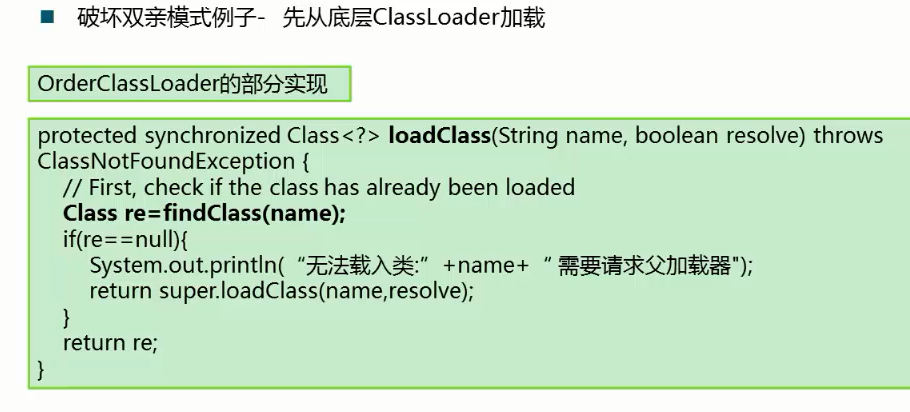

# 类装载器

# 1.class装载验证流程

加载-> 链接（验证、准备、解析）->初始化

## 加载

加载：

- 装载类的第一个阶段
- 取得类的二进制流
- 转为方法区的数据结构
- 再Java堆中生成对应的java.lang.Class对象

## 链接

### 验证

**目的：保证Class流的格式是正确的。**

文件格式的验证：

- 是否以0xCAFEBABE开头
- 版本号是否合理

元数据验证：

- 是否有父类
- 继承了final类
- 非抽象类实现了所有抽象方法

字节码验证（很复杂）

- 运行检查
- 栈数据类型和操作码数据参数吻合
- 跳转指令指定到合理的位置

符号引用验证

- 常量池中描述类是否存在
- 访问的方法或字段是否存在且有足够的权限

### 准备

分配内存，并为类设置初始值（方法区中）

- public static int v=1;
- 在准备阶段中，v会被设置为0
- 在初始化的clinit中才会被设置为1
- 对于static final类型，在准备阶段就会被附上正确的值
- public static final int v=1;

### 解析

符号引用如父类为Object替换为直接引用（地址量）

## 初始化

执行类构造器 clinit

- static变量 赋值语句
- static{}语句

子类的clinit调用前保证父类clinit被调用

clinit是线程安全的。

# 2.什么是类装载ClassLoader

ClassLoader：

- ClassLoader是一个抽象类
- ClassLoader的实例将读入Java字节码将类装载到JVM中
- ClassLoader可以定制，满足不同的字节码流获取方式
- ClassLoader负责类装载过程中的**加载阶段**

ClassLoader的重要方法：

# 3.JDK中ClassLoader默认设计模式

ClassLoader默认设计模式-分类

注：启动ClassLoader没有父亲

 
 每个中的父亲不是指超类，而是指聚合的上层的东西，需要委派其去处理事情。

解决方法：

不是一个单独的东西，什么ClassLoader都可成为这一角色。

# 4.打破常规模式

# 5.热替换

含义：当一个class被替换后，系统无需重启，替换的类立即生效。