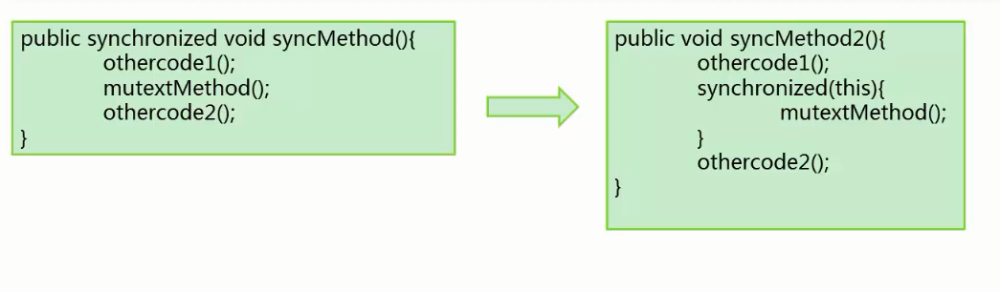
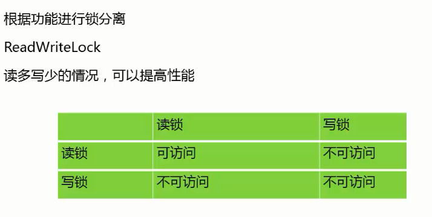

# 锁优化

# 1 JVM层面的锁优化方法

## 对象头Object Header

对象头分为两部分信息：

第一部分用于存储对象自身的运行时数据，如哈希码、GC分代年龄等，官方称为Mark Word。是实现轻量级锁和偏向锁的关键。

第二部分用于存储指向方法区对象类型数据的指针，如果是数组对象，还会有一个额外的部分用于存储数组长度。

## 轻量级锁

轻量级锁不是用来代替重量级锁的，本意是在没有多线程竞争的前提下，减少传统的重量级锁使用操作系统互斥量产生的性能消耗。

轻量级锁能提升程序同步性能的依据是，对于绝大部分的锁，在整个同步周期都是不存在竞争的，这是一个经验数据，如果没有竞争，轻量级锁使用CAS操作避免了使用互斥量的开销。但如果存在锁竞争，除了互斥量的开销外，还额外发生了CAS操作，因此在有竞争的情况下，轻量级锁会比传统的重量锁更慢。

BasicObjectLock:嵌入在**线程栈**中的对象。

普通的锁处理性能不够理想，轻量级锁是一种快速的锁定方法。

如果对象没有被锁定

- 将对象头的Mark指针保存到锁对象中
- 将对象头设置为指向锁的指针（在线程栈空间中）

轻量级锁：

- 如果轻量级锁失败，表示存在竞争，升级为重量级锁（常规锁）
- 在没有锁竞争的前提下，减少传统锁使用OS互斥量产生的性能损耗。
- 在竞争激烈时，轻量锁会多做很多额外操作，导致性能下降。

## 偏向锁

偏向锁的目的是消除数据在无竞争情况下的同步原语，进一步提高程序的运行性能。如果说轻量级锁是在无竞争的情况下使用CAS操作去消除同步使用的互斥量，那偏向锁就是在无竞争的情况下把整个同步都消除掉，连CAS操作都不做了。

当大部分情况是没有竞争的情况下，所以可以通过偏向来提高性能。所谓的偏向，就是偏心，即锁会偏向于第一个获得它的线程，如果在接下来的执行过程中，该锁没有被其他的线程获取，则持有偏向锁的线程将永远不需要再进行同步。将对象头Mark的标记设置为偏向，并将线程ID写入对象头Mark。只要没有竞争，获得偏向锁的线程，在将来进入同步块，不需要做同步。当其他线程请求相同的锁时，偏向模式结束。

-XX：+UseBiasedLocking -默认启用

在竞争激烈的场合，偏向锁会增加系统负担。可以使用-XX:-UseBiasedLocking来禁止偏向锁优化从而提升性能。

## 自旋锁

互斥同步对性能最大的影响是阻塞的实现，挂起线程和恢复线程的操作都需要转入内核态中完成，这些操作给操作系统的并发性能带来很大压力。

当竞争存在时，**如果线程可以很快获得锁**，那么可以不在OS层挂起线程，让后来请求锁的线程做几个空操作（自旋）

JDK1.6中-XX：+UseSpinning开启

JDK1.7中，去掉此参数，改为内置实现如果同步块很长，自旋失败，会降低系统性能

如果同步块很短，自旋成功，节省线程挂起切换时间，提升系统性能，反之如果锁被占用的时间很长，自旋的线程只会白白消耗处理器资源，而不会做任何有用的工作，反而会带来性能上的浪费。

## 偏向锁，轻量级锁，自旋锁总结

不是Java语言层面的锁优化方法。

内置于JVM中的获取锁的优化方式和获取锁的步骤：

- 偏向锁可用会先尝试偏向锁
- 轻量级锁可用会尝试轻量级锁
- 以上都失败，尝试自旋锁
- 再失败，尝试普通锁，使用OS互斥量在操作系统层挂起。

# 2 Java语言层面的锁优化

## 减少锁持有时间

等待时间减小，自旋的成功率会增大。

## 减小锁粒度

将大对象拆成小对象，大大增加并行度，降低锁竞争

偏向锁，轻量级锁成功率提高

典型示例 ConcurrentHashMap

## 锁分离

## 锁粗化

通常情况下，为了保证多线程间的有效并发，会要求每个线程持有锁的时间尽量短，即在使用完公共资源后，应该立即释放锁。只有这样，等待在这个锁上的其他线程才能尽早的获得资源执行任务。但是，凡事都有一个度，如果对同一个锁不停的进行请求、同步和释放，其本身也会消耗系统宝贵的资源，反而不利于性能的优化。

## 锁消除

在即时编译器时，如果发现不可能被共享的对象，则可以消除这些对象的锁操作。

## 无锁

CAS（非阻塞的同步）

